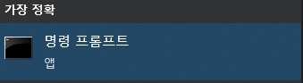
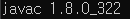
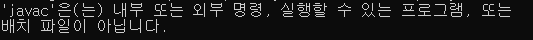
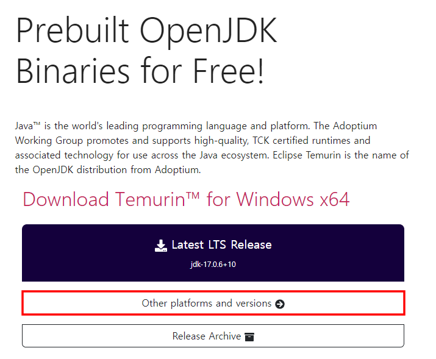
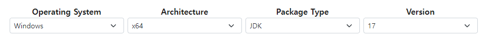
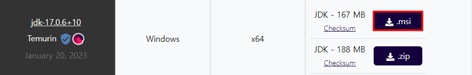
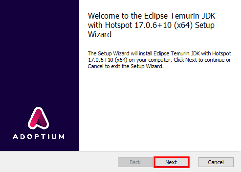
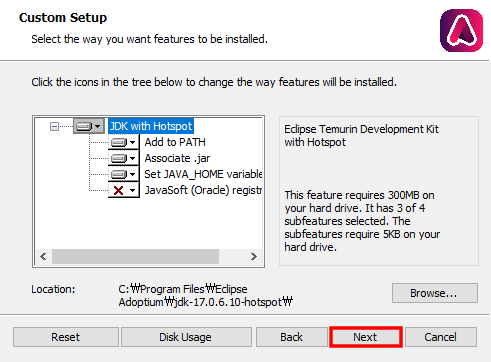
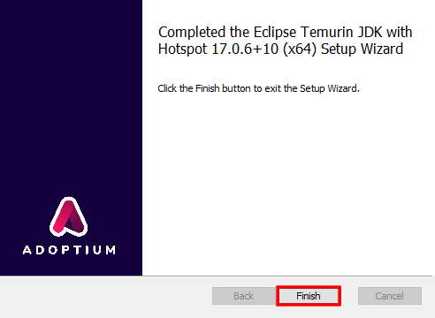

## 기초 환경 설정하기

### JDK 설치 확인하기

자바를 개발하기 위해서는 각 컴퓨터에 JDK(Java Development Kit)이라고 불리는 프로그램이 미리 설치되어있어야 합니다.

JDK가 설치되어있는지 확인하려면, 다음과 같은 방법을 따릅니다.

1. 윈도우 키를 누르고, cmd를 입력합니다. 
   
2. **명령 프롬프트**를 클릭하여 실행합니다.  
   
3. `javac -version`을 입력합니다. 
   
4. 실행 결과를 확인합니다. 다음과 비슷한 로그가 발생한다면, JDK가 정상 설치된 것입니다. 
   사용자마다 설치된 JDK 버전이 다를 수 있기에, 비슷한 로그가 발생하는것으로 확인합니다. 
    
   만약, 다음과 같은 로그가 발생한다면 JDK가 설치되지 않은것으로 간주합니다.  
   

### JDK 설치하기

현재의 JDK는 OpenJDK로부터 내려와 수많은 변종이 존재합니다.

본 문서에서는 Adoptium (AdoptOpenJDK)를 자동 설치기를 통해 설치함을 목적으로 합니다.

1. [Adoptium](https://adoptium.net/) 사이트에 접속합니다.
2. **Other platforms and versions**를 눌러 다른 버전을 조회합니다. 
   
3. 플랫폼을 **Windows**, 아키텍쳐를 **x64**, 패키지 타입을 **JDK**로 변경합니다. 
   자바는 일반적으로 하위 호환성을 가지기에 버전은 크게 중요하지 않습니다. 
   
4. **msi** 버튼을 눌러 윈도우 기반 자동 설치기를 다운로드받습니다. 
   
5. 다운로드받은 msi 파일을 실행하고, 다음을 누릅니다. 
   
6. 이전에는 자바 설치 후, 환경 변수를 설정해야했으나 Adoptium은 설정에 따라 자동으로 설정됩니다. 
   다음 화면과 동일한지 확인하고, 다음을 누릅니다. 
   
7. 모든 설치 준비가 완료되었습니다. Install을 누릅니다. 관리자 권한 요구 창이 뜬다면, 예를 눌러줍니다. 
   
8. JDK 설치가 완료되었습니다. Finish를 눌러 창을 닫습니다. 
   
9. 기초 환경 설치하기 페이지의 [JDK 설치 확인하기]()를 따라 JDK의 설치를 확인합니다. 
   환경 변수의 업데이트를 위해 기존 명령 프롬프트창을 닫고, 새로 열어 확인해야 합니다.