## 안드로이드 개발환경 설정하기

### Android Studio 설치하기

안드로이드는 일반 JDK와는 달리 특정 IDE가 필요합니다.

이는 안드로이드가 표준 JVM이 아닌 다른 가상 머신을 사용하기 때문입니다. 

이 섹션에서는 Android 어플리케이션 개발용 IDE, Android Studio의 설치 방법을 안내합니다.

1. [Android Studio 공식 페이지](https://developer.android.com/studio)에 접속하고, 다운로드 버튼을 누릅니다. 
    해당 문서가 작성될 시점을 기준으로는, 현재 버전은 Giraffe입니다.
    
2. 표시된 약관 동의 창의 스크롤을 맨 아래로 내립니다.
    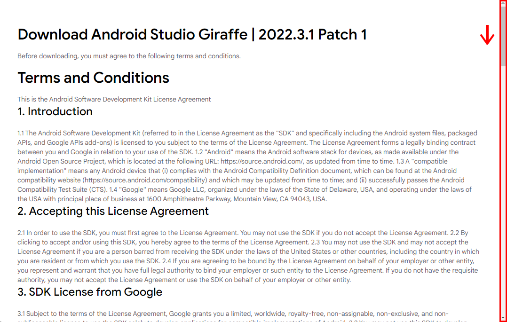
3. 약관 동의를 클릭하여 버튼을 활성화시키고, 파일 다운로드 버튼을 눌러 IDE를 다운로드받습니다.
    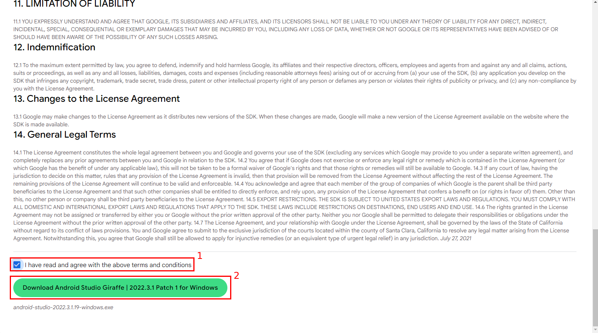
4. 설치 프로그램을 실행하고, Next를 누릅니다. 
    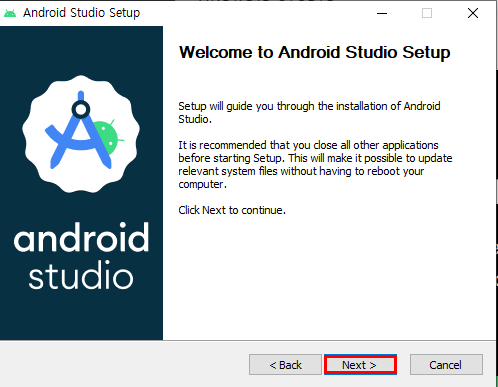
5. <b>Android Virtual Device</b>가 선택된 상태로 Next를 누릅니다.
   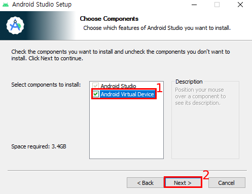
6. 설치 경로는 바꾸지 않습니다. Next를 누릅니다.
   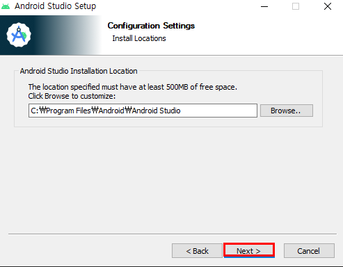
7. 숏컷을 생성하는 상태로 설치합니다. Install을 누릅니다.
   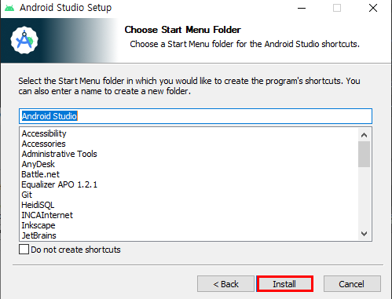
8. 설치 완료 후, Android Studio를 실행합니다.
   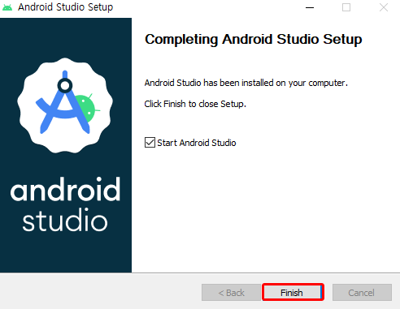
9. 이전 설정은 필요하지 않습니다. import 하지 않는 상태로 Ok를 누릅니다.
   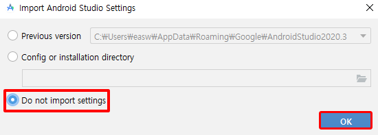
10. Next를 누릅니다.
   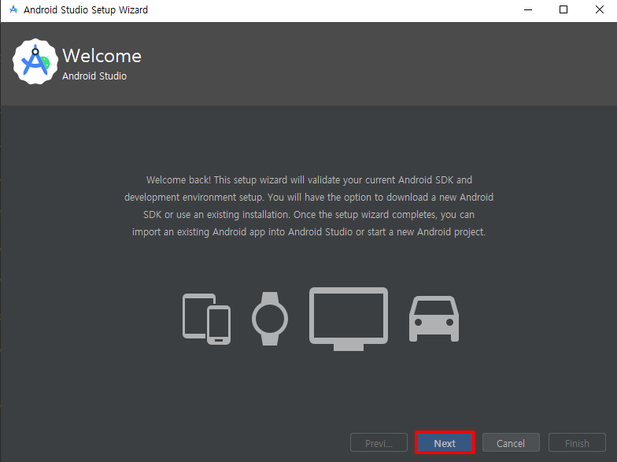
11. 기본 설정 상태로 선택하고, Next를 누릅니다.
    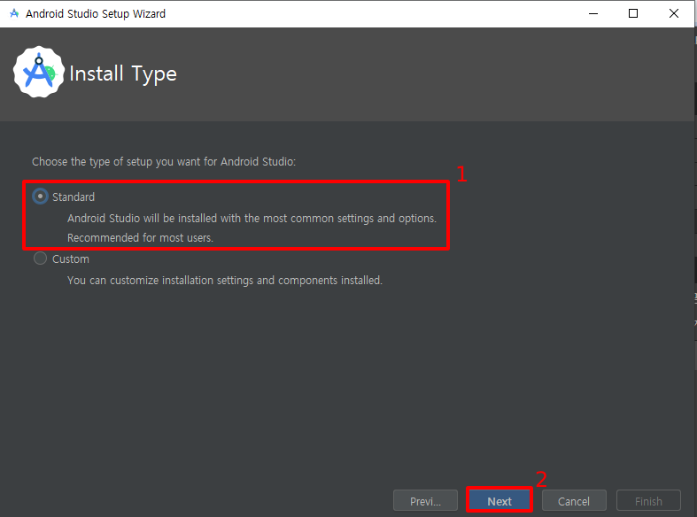
12. Install을 눌러 필수 요소 설치를 시작합니다.
    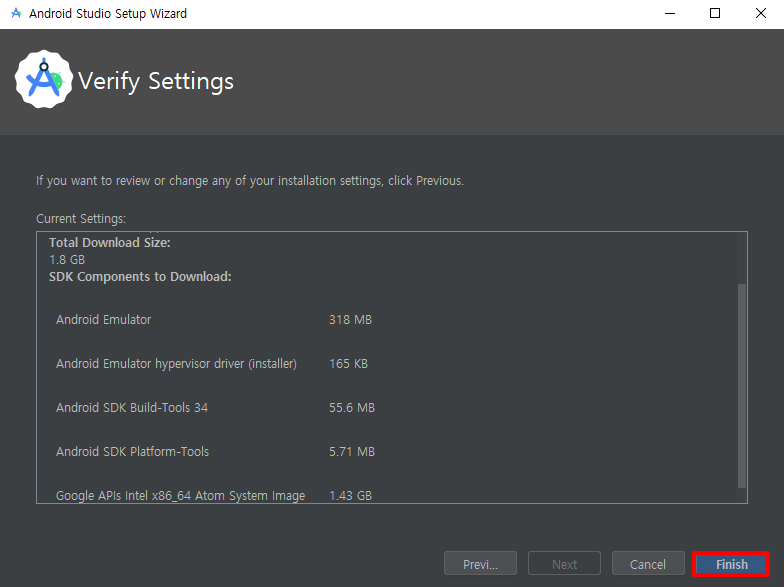
13. 설치가 완료될 때까지 기다립니다.
    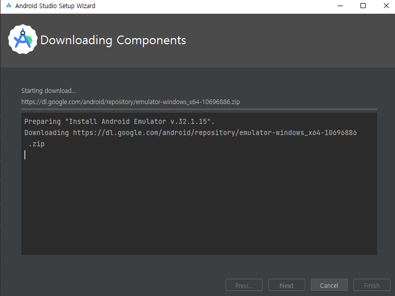
