## 안드로이드 개발환경 설정하기

### Android Studio 설치하기

안드로이드는 일반 JDK와는 달리 특정 IDE가 필요합니다.

이는 안드로이드가 표준 JVM이 아닌 다른 가상 머신을 사용하기 때문입니다. 

이 섹션에서는 Android 어플리케이션 개발용 IDE, Android Studio의 설치 방법을 안내합니다.

1. [Android Studio 공식 페이지](https://developer.android.com/studio)에 접속하고, 다운로드 버튼을 누릅니다. 
    해당 문서가 작성될 시점을 기준으로는, 현재 버전은 Giraffe입니다.
    
2. 표시된 약관 동의 창의 스크롤을 맨 아래로 내립니다.
    
3. 약관 동의를 클릭하여 버튼을 활성화시키고, 파일 다운로드 버튼을 눌러 IDE를 다운로드받습니다.
    
4. 설치 프로그램을 실행하고, `Next`를 누릅니다. 
    
5. <b>Android Virtual Device</b>가 선택된 상태로 `Next`를 누릅니다.
   
6. 설치 경로는 바꾸지 않습니다. `Next`를 누릅니다.
   
7. 숏컷을 생성하는 상태로 설치합니다. `Install`을 누릅니다.
   
8. 설치 완료 후, `Android Studio`를 실행합니다.
   
9. 이전 설정은 필요하지 않습니다. import 하지 않는 상태로 `OK`를 누릅니다.
   
10. Next를 누릅니다.
   
11. 기본 설정 상태로 선택하고, `Next`를 누릅니다.
    
12. Install을 눌러 필수 요소 설치를 시작합니다.
    
13. 설치가 완료될 때까지 기다립니다.
    
14. 완료되었다면 `Finish`를 누릅니다.
    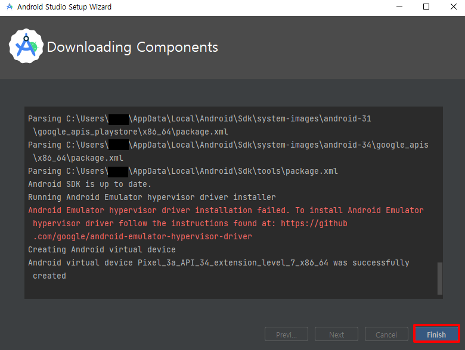

### Android 에뮬레이터 및 NDK 설치하기

1. 설정 창을 열기 위해 새 프로젝트 생성을 누릅니다.
   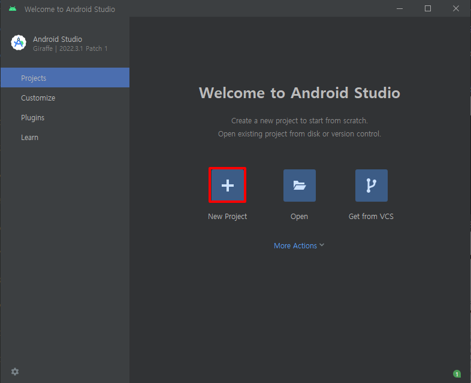
2. 해당 프로젝트는 현재 강의에 사용하지 않습니다. 설정을 위해 빈 프로젝트를 생성합니다.
   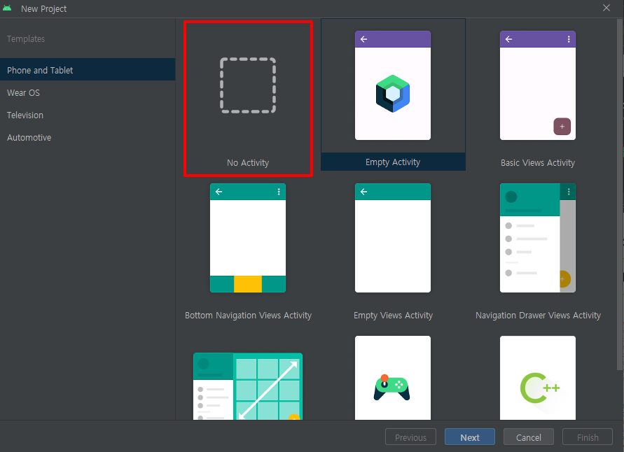
3. 해당 프로젝트는 사용하지 않기에, `Finish`를 눌러 샘플 프로젝트를 생성합니다.
   
4. 기본적인 에뮬레이터 요소가 다운로드됩니다. 다운로드 완료를 대기합니다.
   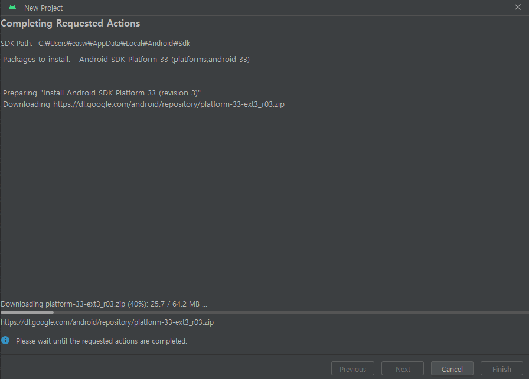
5. 다운로드가 완료되었다면, `Finish`를 눌러 완료합니다.
   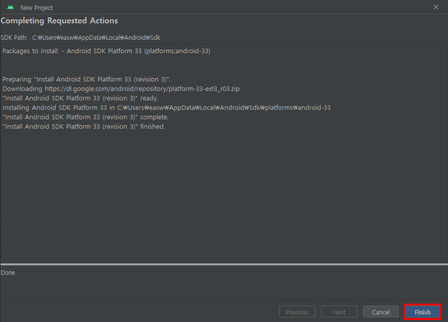
6. IDE에서 더 빠른 컴파일과 코드 분석을 위해 인덱싱을 진행중입니다. 인덱싱 진행도 바가 사라질때까지 대기합니다.
   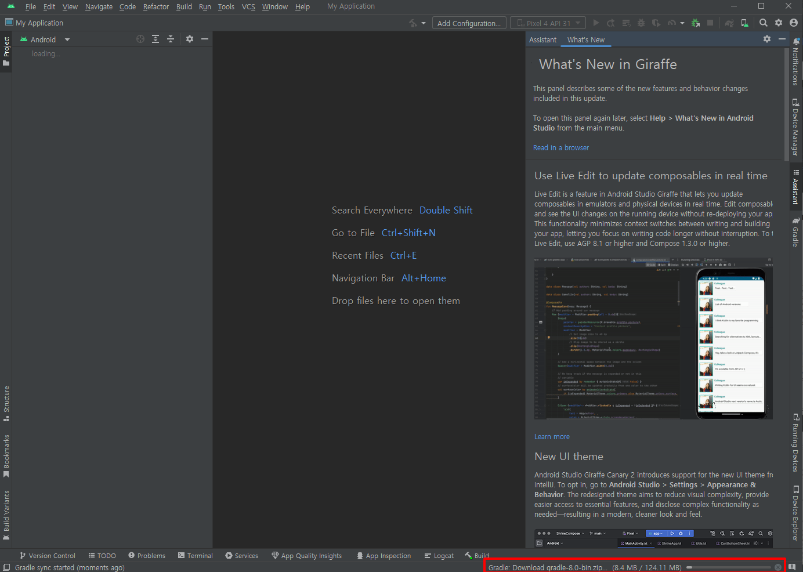
7. 툴바에서 Tools를 누르고, `Device Manager`을 누릅니다.   
   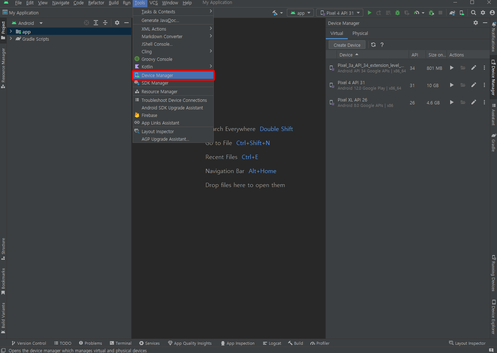
8. 우측에 표시된 `Device Manager` 창에서 `Create Device`를 누릅니다.  
   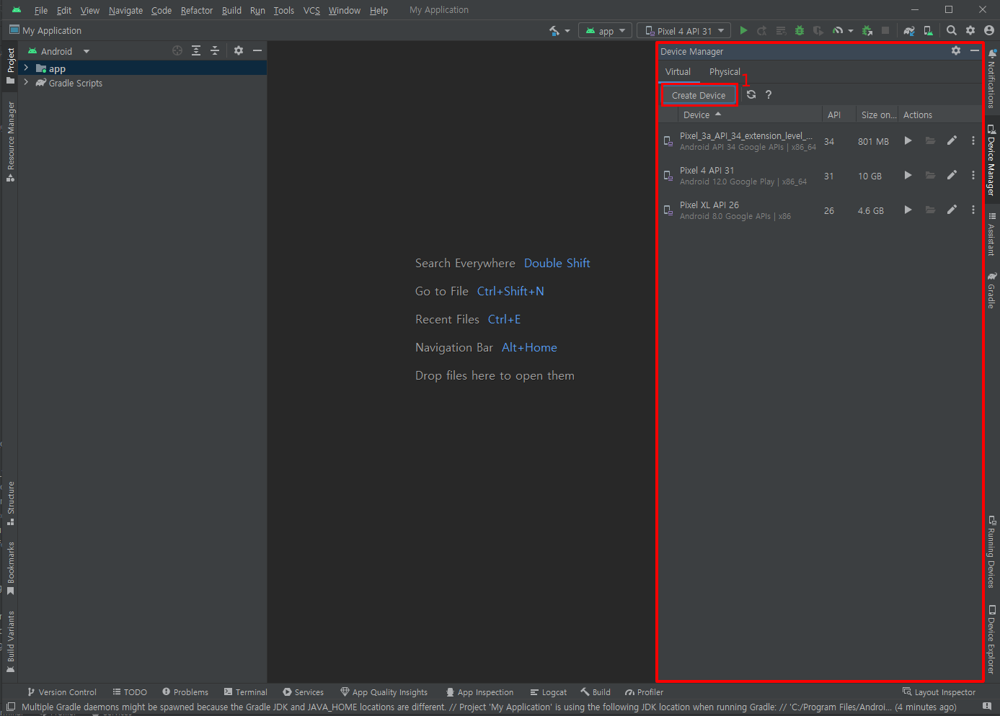 
9. 해당 강의에서는 `Pixel XL`을 사용합니다. `Pixel XL`을 누르고 `Next`를 누릅니다.
   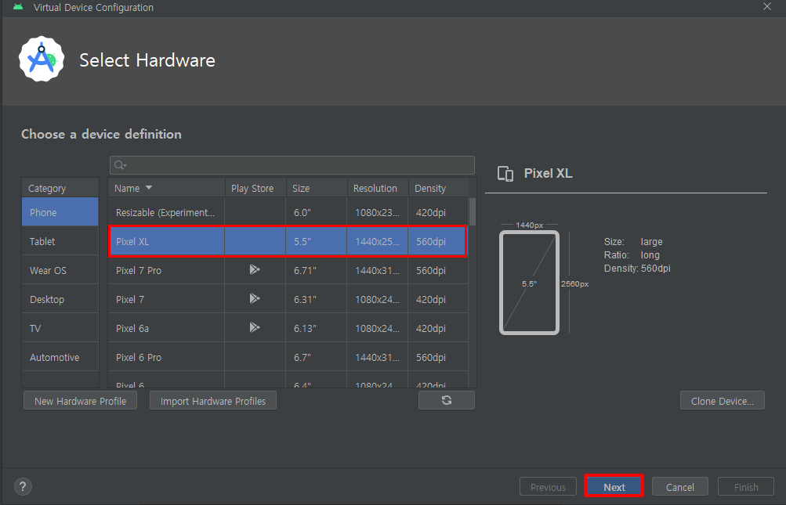
10. 해당 강의에서는 안드로이드 13(티라미수)를 사용합니다. Tiramisu의 다운로드 표시를 누릅니다.
    
11. `Accept`를 눌러 약관에 동의하고, Next를 눌러 설치합니다.
    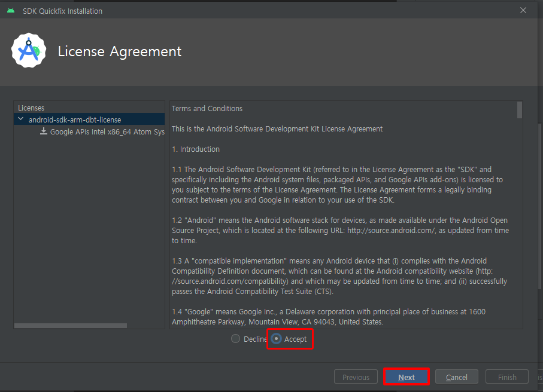
12. 해당 에뮬레이터 버전이 설치될때까지 대기합니다.
    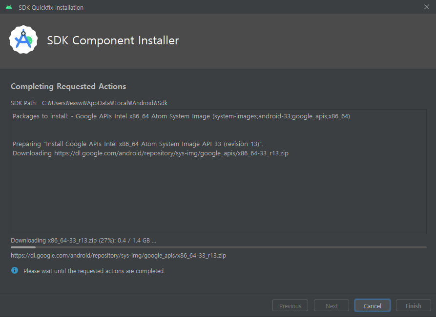