## 잘못된 IDE 인코딩 고치기 - Eclipse

해당 문서에서는 잘못된 기본 인코딩으로 인해 Eclipse IDE 환경에서 한글이 깨지는 문제의 해결 방법에 대해 다룹니다.

### IDE 한글 깨짐 고치기
1. Eclipse를 켭니다. 
   
2. 툴바에서 Window를 클릭합니다. 
   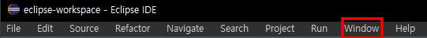
3. 활성화된 옵션 창에서 Preference를 클릭합니다. 
   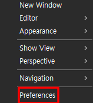
4. Preference 창에서 General에 더블클릭하여 탭을 확장합니다. 
   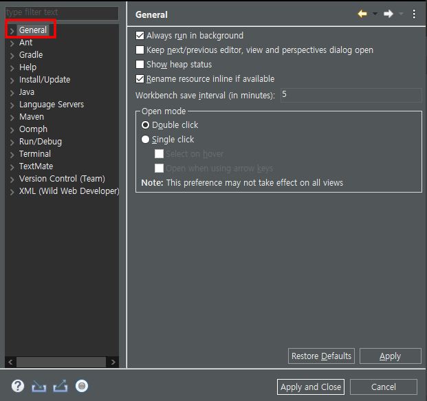
5. General 탭의 Contents Types을 클릭합니다. 
   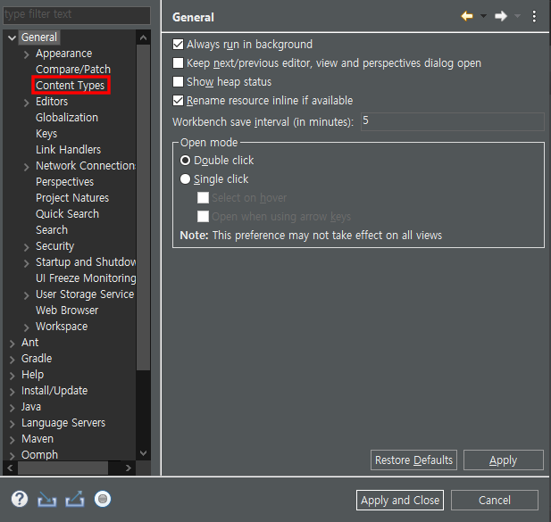
6. 우측 창에서 Java Class Type을 클릭합니다. 
   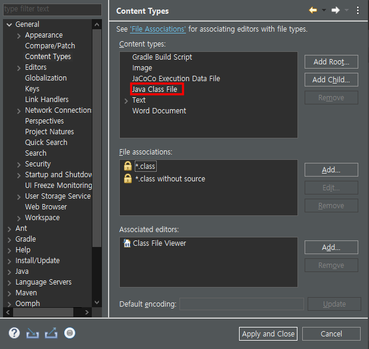
7. 아래의 텍스트 창에 UTF-8을 입력하고, Update를 누릅니다. 
   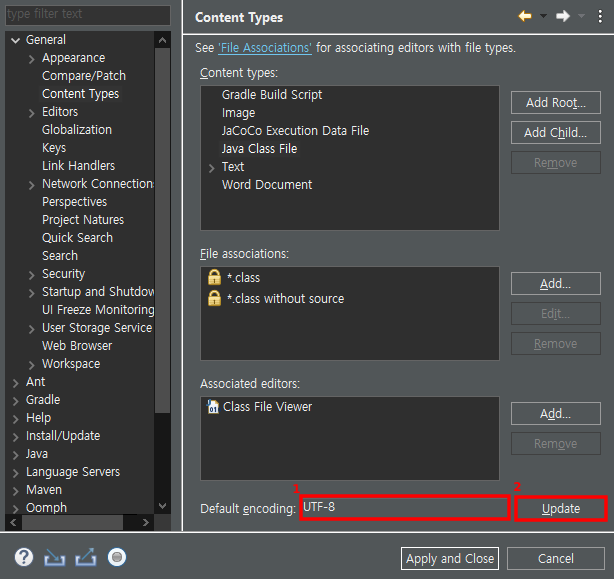
8. 좌측 탭의 WorkSpace를 누릅니다. 
   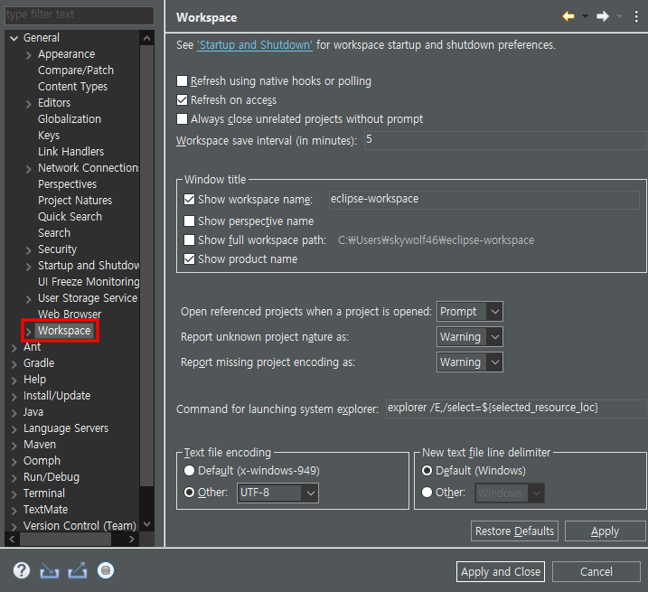
9. 우측 탭의 **Text file Encoding**이 `Other: UTF-8`이 아니면, **Other** 라디오 버튼을 클릭하고, UTF-8로 조정한 다음, Apply를 누릅니다. 
   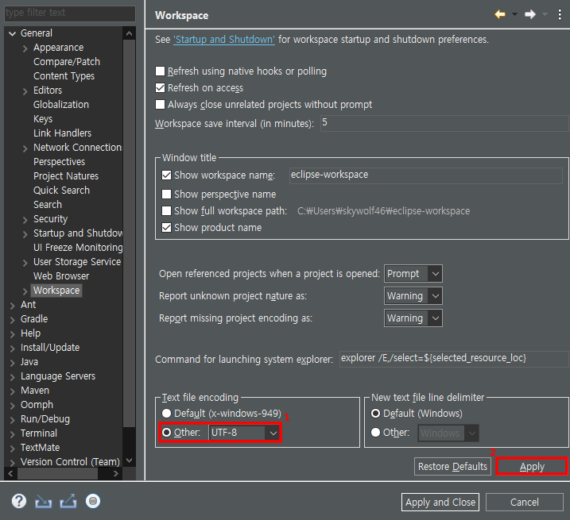
10. Apply and CLose를 누릅니다.   
    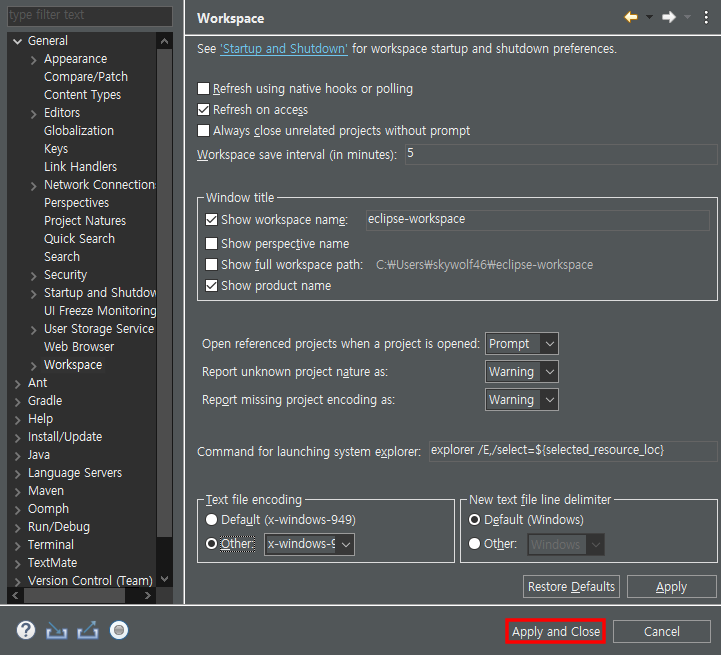

### 콘솔 한글 꺠짐 고치기
1. 툴바에서 Run을 클릭합니다. 
   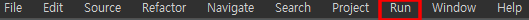
2. Run 메뉴에서 **Run Configuration**을 클릭합니다. 
   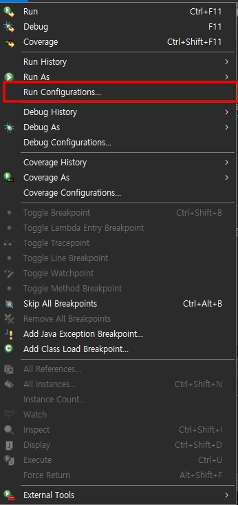
3. 실행하고자 하는 Configuration을 선택합니다. 해당 예제에서는 Test.class를 메인으로 사용함으로, Test를 선택하였습니다. 
   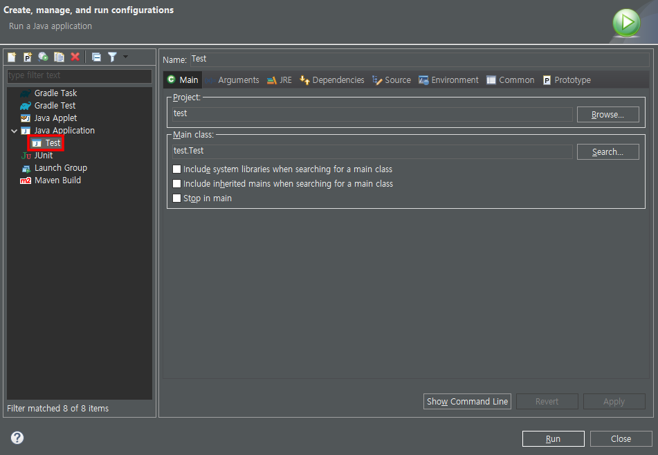
4. 우측 탭에서 **Common**을 클릭합니다. 
   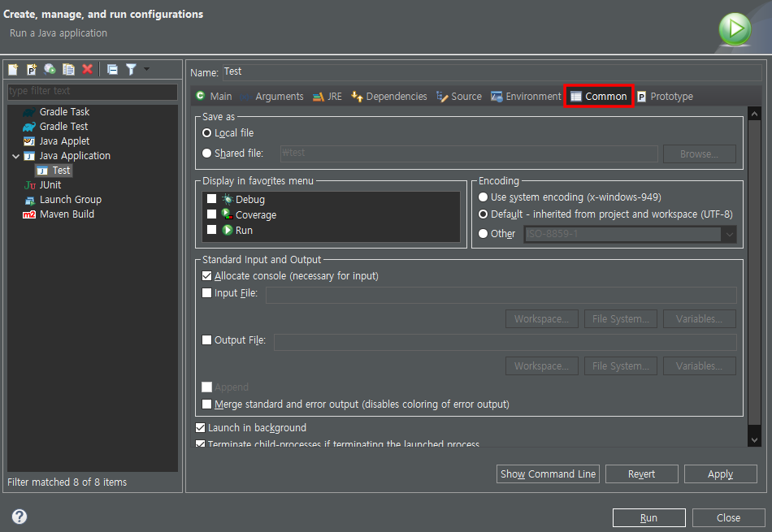
5. 우측 탭에서 **Other**을 클릭하고, **UTF-8**로 변경합니다. 변경 후에, Apply를 누릅니다.
   해당 설정은 인코딩 문제가 다시 발생할 경우, 재적용해야 합니다. 
   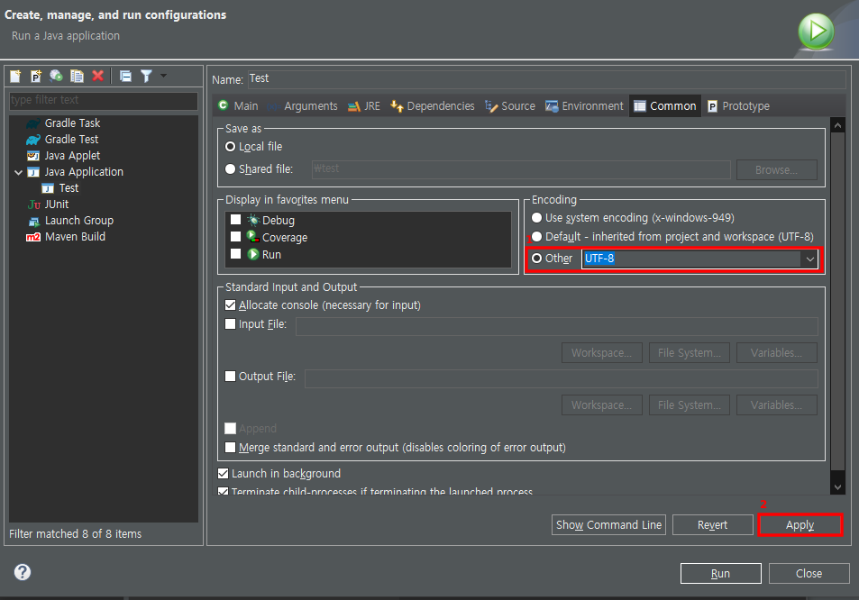
